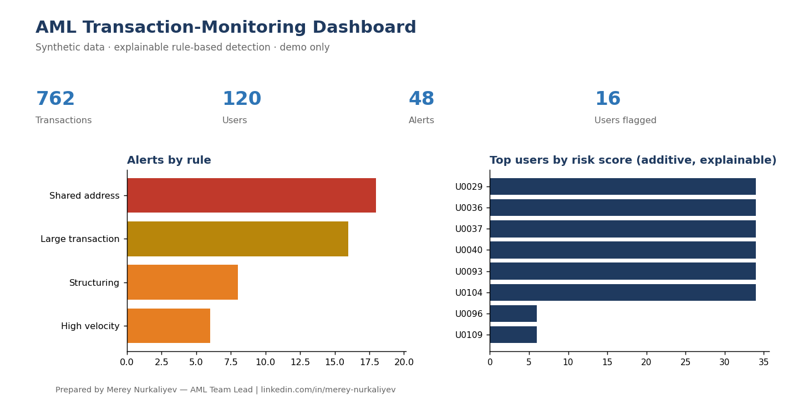

# AML Transaction-Monitoring Demo

A small, **explainable** rule-based engine that screens crypto transactions for
common money-laundering typologies and produces an auditable alert set, a
transparent risk score, and a one-glance dashboard.

> ⚠️ **Synthetic data only.** Every transaction, user and address in this repo is
> randomly generated (`generate_synthetic_data.py`). There is **no** real, client,
> or employer data of any kind. This is a portfolio demo, not a production system.



## Why this exists

Most transaction monitoring fails in one of two ways: it's a black box nobody can
explain to a regulator, or it's a spreadsheet nobody can scale. This demo shows the
middle path I favour as an AML practitioner — **rules that are transparent,
parameterised and defensible**, with an additive risk score where every point can
be traced back to a specific reason.

It mirrors the kind of weekly monitoring I run in practice (structuring,
shared-address clustering, high-velocity outflows), rebuilt from scratch on
synthetic data.

## What it detects

| Rule | Typology | Severity |
|------|----------|----------|
| `LARGE_TRANSACTION` | Single transfers at/above the reporting threshold | Medium |
| `STRUCTURING` | Repeated amounts parked just below the threshold | High |
| `RAPID_FIRE` | Many withdrawals in a single day (layering) | High |
| `HIGH_VELOCITY` | Aggregate 24h outflow above a velocity limit | High |
| `SHARED_ADDRESS` | One destination address funded by many users (mixer / P2P) | Critical |

Each alert is a small auditable record: `user_id, rule, severity, detail, evidence`.
Thresholds live at the top of `aml_rules.py` — a real programme tunes these to its
own risk appetite.

## Run it

```bash
pip install -r requirements.txt
python run_demo.py
```

Outputs:

- `flags.csv` — every alert with its reason and evidence
- `risk_scores.csv` — per-user additive risk score (explainable)
- `dashboard.png` — the summary view above

## Example output

```
 Transactions analysed : 762
 Users                 : 120
 Alerts raised         : 48
 Users flagged         : 16
 Alerts by rule:
   SHARED_ADDRESS     18
   LARGE_TRANSACTION  16
   STRUCTURING         8
   HIGH_VELOCITY       6
```

## Project layout

```
generate_synthetic_data.py   # builds the synthetic transaction set (seeded)
aml_rules.py                 # the explainable detection rules + risk scoring
run_demo.py                  # runs everything, writes CSVs + dashboard.png
```

## Roadmap (where this goes next)

- Graph/network view of fund flows between addresses
- ML anomaly layer **on top of** the rules (never replacing the explainable core)
- RAG assistant over public rulebooks (VARA / SFC / AIFC / FATF) for alert context

## License

MIT — see [LICENSE](LICENSE).

---

Built by **Merey Nurkaliyev** — AML Team Lead, crypto compliance & on-chain
investigations. [linkedin.com/in/merey-nurkaliyev](https://www.linkedin.com/in/merey-nurkaliyev)
